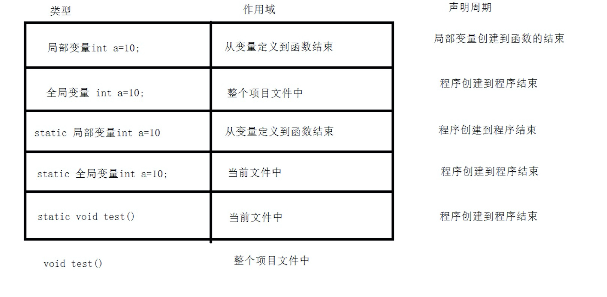

# C++语法

## gcc编译过程


- 预处理
    - 1，宏定义展开
    - 2，头文件展开
    - 3，删除注释
    - 4，条件编译
    - gcc -E a.c -o a.i
- 编译
    - 1，检查语法
    - 2，转换成汇编语言
    - gcc -S a.i -o a.s
- 汇编
    - 1，汇编语言转换成机器语言
    - gcc -c a.s -o a.o
- 链接
    - 1，将库文件链接变成可执行文件
    - gcc a.o -o a.exe


## 指针


### 指针和数组

- 数组名是数组的首地址，所以可以直接赋值给指针
- 对被复制的指针操作，间接操作数组
- 通过```*p = xxx; *(p + 1) = xxx```的方式可以改变数组项的值

```c
int arr[10];
int *p = arr;

*p = 1; // arr[0]
*(p + 1) = 2; // arr[1]
p[3] = 3; // arr[3]


for(int i = 0; i < 10; i++)
{
    cout << p[i] << endl;
}
```

## 变量

一个变量定义之后可以在整个项目多文件中使用，但是需要先声明

```c
extern int a;
```

### 静态变量

- 静态局部变量： 只会被初始化一次，函数多次调用，使用的是同一个局部变量。
- 静态全局变量（函数）： 只能在声明的那个文件中使用。

## 变量的作用域和生命周期




## 内存操作

- malloc： 用来开辟空间
- memset： 重置内存


## 复合数据类型

### 结构体


### 共用体

### 枚举


 


