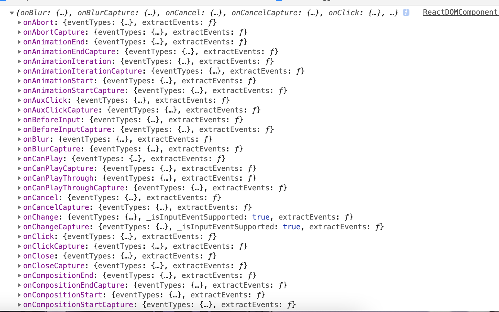
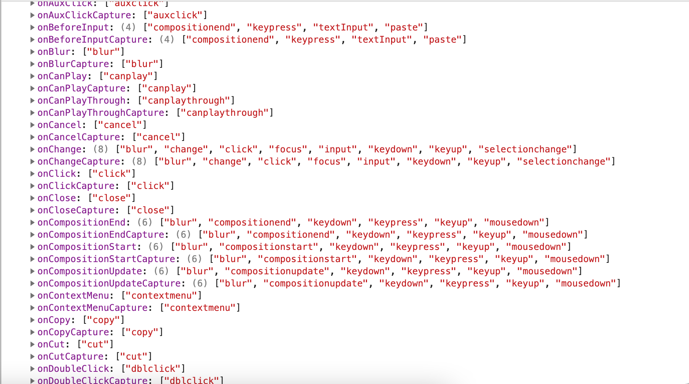

# React 合成事件系统


合成事件系统的好处：

- 减少内存消耗，提升性能，不需要注册那么多的事件了，一种事件类型只在 document 上注册一次
- 统一规范，解决 ie 事件兼容问题，简化事件逻辑
- 对开发者友好

合成事件主要做了：

- 对原生事件的封装
- 对某些事件的升级和改造
- 不同浏览器事件兼容的处理

下面将会从**事件注册**和**事件派发**两个阶段进行说明。

## 事件注册

事件注册可以分为两个过程：
- 事件注册过程
- 事件存储过程

### 事件注册过程

在```CompleteWork```时，```case HostComponent``` 则会依次调用```finalizeInitialChildren -> setInitialProperties```

::: details 查看setInitialProperties代码 

```js
export function setInitialProperties(
  domElement: Element,
  tag: string,
  rawProps: Object,
  rootContainerElement: Element | Document,
): void {
  const isCustomComponentTag = isCustomComponent(tag, rawProps);
  if (__DEV__) {
    validatePropertiesInDevelopment(tag, rawProps);
  }

  // TODO: Make sure that we check isMounted before firing any of these events.
  let props: Object;
  switch (tag) {
    case 'iframe':
    case 'object':
    case 'embed':
      if (!enableModernEventSystem) {
        legacyTrapBubbledEvent(TOP_LOAD, domElement);
      }
      props = rawProps;
      break;
    case 'video':
    case 'audio':
      if (!enableModernEventSystem) {
        // Create listener for each media event
        for (let i = 0; i < mediaEventTypes.length; i++) {
          legacyTrapBubbledEvent(mediaEventTypes[i], domElement);
        }
      }
      props = rawProps;
      break;
    case 'source':
      if (!enableModernEventSystem) {
        legacyTrapBubbledEvent(TOP_ERROR, domElement);
      }
      props = rawProps;
      break;
    case 'img':
    case 'image':
    case 'link':
      if (!enableModernEventSystem) {
        legacyTrapBubbledEvent(TOP_ERROR, domElement);
        legacyTrapBubbledEvent(TOP_LOAD, domElement);
      }
      props = rawProps;
      break;
    case 'form':
      if (!enableModernEventSystem) {
        legacyTrapBubbledEvent(TOP_RESET, domElement);
        legacyTrapBubbledEvent(TOP_SUBMIT, domElement);
      }
      props = rawProps;
      break;
    case 'details':
      if (!enableModernEventSystem) {
        legacyTrapBubbledEvent(TOP_TOGGLE, domElement);
      }
      props = rawProps;
      break;
    case 'input':
      ReactDOMInputInitWrapperState(domElement, rawProps);
      props = ReactDOMInputGetHostProps(domElement, rawProps);
      if (!enableModernEventSystem) {
        legacyTrapBubbledEvent(TOP_INVALID, domElement);
      }
      // For controlled components we always need to ensure we're listening
      // to onChange. Even if there is no listener.
      ensureListeningTo(rootContainerElement, 'onChange');
      break;
    case 'option':
      ReactDOMOptionValidateProps(domElement, rawProps);
      props = ReactDOMOptionGetHostProps(domElement, rawProps);
      break;
    case 'select':
      ReactDOMSelectInitWrapperState(domElement, rawProps);
      props = ReactDOMSelectGetHostProps(domElement, rawProps);
      if (!enableModernEventSystem) {
        legacyTrapBubbledEvent(TOP_INVALID, domElement);
      }
      // For controlled components we always need to ensure we're listening
      // to onChange. Even if there is no listener.
      ensureListeningTo(rootContainerElement, 'onChange');
      break;
    case 'textarea':
      ReactDOMTextareaInitWrapperState(domElement, rawProps);
      props = ReactDOMTextareaGetHostProps(domElement, rawProps);
      if (!enableModernEventSystem) {
        legacyTrapBubbledEvent(TOP_INVALID, domElement);
      }
      // For controlled components we always need to ensure we're listening
      // to onChange. Even if there is no listener.
      ensureListeningTo(rootContainerElement, 'onChange');
      break;
    default:
      props = rawProps;
  }

  assertValidProps(tag, props);

  setInitialDOMProperties(
    tag,
    domElement,
    rootContainerElement,
    props,
    isCustomComponentTag,
  );

  switch (tag) {
    case 'input':
      // TODO: Make sure we check if this is still unmounted or do any clean
      // up necessary since we never stop tracking anymore.
      track((domElement: any));
      ReactDOMInputPostMountWrapper(domElement, rawProps, false);
      break;
    case 'textarea':
      // TODO: Make sure we check if this is still unmounted or do any clean
      // up necessary since we never stop tracking anymore.
      track((domElement: any));
      ReactDOMTextareaPostMountWrapper(domElement, rawProps);
      break;
    case 'option':
      ReactDOMOptionPostMountWrapper(domElement, rawProps);
      break;
    case 'select':
      ReactDOMSelectPostMountWrapper(domElement, rawProps);
      break;
    default:
      if (typeof props.onClick === 'function') {
        // TODO: This cast may not be sound for SVG, MathML or custom elements.
        trapClickOnNonInteractiveElement(((domElement: any): HTMLElement));
      }
      break;
  }
}

```

:::

这个方法会对表单元素进行一些处理，其中比较重要是调用```setInitialDOMProperties```方法：


```js
function setInitialDOMProperties(
  tag: string,
  domElement: Element,
  rootContainerElement: Element | Document,
  nextProps: Object,
  isCustomComponentTag: boolean,
): void {
  for (const propKey in nextProps) {
    if (!nextProps.hasOwnProperty(propKey)) {
      continue;
    }
    const nextProp = nextProps[propKey];
    ... 


     if (registrationNameModules.hasOwnProperty(propKey)) {
      if (nextProp != null) {
        ensureListeningTo(rootContainerElement, propKey);
      }
    }

  ... 
}
```
在这个方法中会通过```registrationNameModules```判断props中是否是注册事件的Prop,其中registrationNameModules如下图：




当判断属性是事件时会调用```ensureListeningTo -> legacyListenToEvent```, 在```legacyListenToEvent```中会获取事件对应的依赖事件,然后对每一个依赖的事件调用```legacyListenToTopLevelEvent```进行注册。




```js
export function legacyListenToEvent(
  registrationName: string,
  mountAt: Document | Element,
): void {
  const listenerMap = getEventListenerMap(mountAt);
  const dependencies = registrationNameDependencies[registrationName];

  for (let i = 0; i < dependencies.length; i++) {
    const dependency = dependencies[i];
    legacyListenToTopLevelEvent(dependency, mountAt, listenerMap);
  }
}
```


## 事件派发
