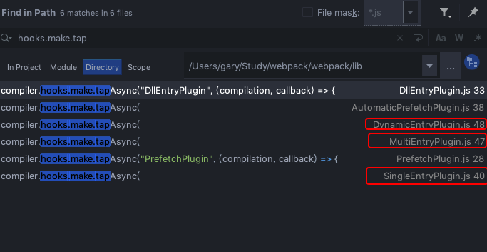

# Webpack源码-构建

## 找到入口

上文讲到，通过触发```compiler.hooks.make```钩子正式进入构建阶段，全局搜索注册了这个钩子的事件：



可以看到，主要是*EntryPlugin*注册了它,webpack会更具配置中的*entry*类型决定使用哪一个plugin,而这里的判断逻辑来自于上文中创建compiler前调用的```new WebpackOptionsApply().process(options, compiler)```中的 
```js
new EntryOptionPlugin().apply(compiler);
```

具体看看*EntryOptionPlugin().apply*:
```js
	apply(compiler) {
		compiler.hooks.entryOption.tap("EntryOptionPlugin", (context, entry) => {
			if (typeof entry === "string" || Array.isArray(entry)) {
				itemToPlugin(context, entry, "main").apply(compiler);
			} else if (typeof entry === "object") {
				for (const name of Object.keys(entry)) {
					itemToPlugin(context, entry[name], name).apply(compiler);
				}
			} else if (typeof entry === "function") {
				new DynamicEntryPlugin(context, entry).apply(compiler);
			}
			return true;
		});
	}
```

这里以对象形式的entry为例，遍历对象的每一项，最终每一项都调用*SingleEntryPlugin*，

```js
// SingleEntryPlugin

	apply(compiler) {
		compiler.hooks.compilation.tap(
			"SingleEntryPlugin",
			(compilation, { normalModuleFactory }) => {
				compilation.dependencyFactories.set(
					SingleEntryDependency,
					normalModuleFactory
				);
			}
		);

		compiler.hooks.make.tapAsync(
			"SingleEntryPlugin",
			(compilation, callback) => {
				const { entry, name, context } = this;

				const dep = SingleEntryPlugin.createDependency(entry, name);
				compilation.addEntry(context, dep, name, callback);
			}
		);
	}
```
SingleEntryPlugin会注册*compiler.hooks.make*,所以```compiler.hooks.make```触发后，会继续接下来的流程：根据entry创建dep，然后调用```compilation.addEntry(context, dep, name, callback);```

::: details 查看compilation.addEntry方法
```js
	addEntry(context, entry, name, callback) {
		this.hooks.addEntry.call(entry, name);

		const slot = {
			name: name,
			// TODO webpack 5 remove `request`
			request: null,
			module: null
		};

		if (entry instanceof ModuleDependency) {
			slot.request = entry.request;
		}

		// TODO webpack 5: merge modules instead when multiple entry modules are supported
		const idx = this._preparedEntrypoints.findIndex(slot => slot.name === name);
		if (idx >= 0) {
			// Overwrite existing entrypoint
			this._preparedEntrypoints[idx] = slot;
		} else {
			this._preparedEntrypoints.push(slot);
		}
		this._addModuleChain(
			context,
			entry,
			module => {
				this.entries.push(module);
			},
			(err, module) => {
				if (err) {
					this.hooks.failedEntry.call(entry, name, err);
					return callback(err);
				}

				if (module) {
					slot.module = module;
				} else {
					const idx = this._preparedEntrypoints.indexOf(slot);
					if (idx >= 0) {
						this._preparedEntrypoints.splice(idx, 1);
					}
				}
				this.hooks.succeedEntry.call(entry, name, module);
				return callback(null, module);
			}
		);
	}
```
:::


