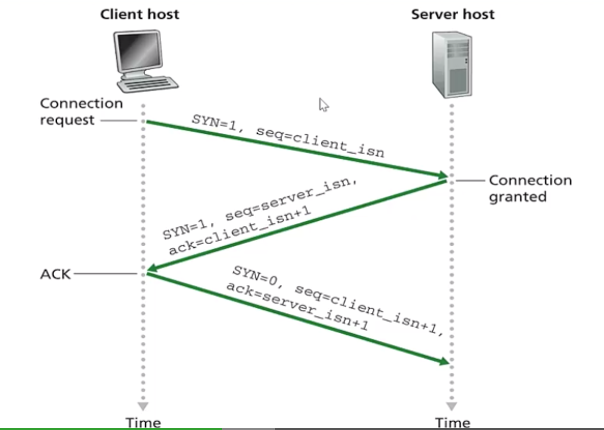
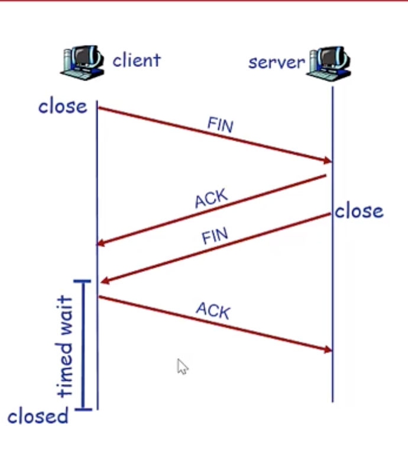

# 计算机网络

## 计算机网络概述

### 几个概念

- **套接字（socket）**： 应用程序和网络之间的编程接口。(理解为两个房子需要通信，而套接字就是房子的门)。
- **端口号**： 定义在目的主机中接收进程的标识符。
- **带宽敏感应用**： 具有吞吐量要求的应用程序。
- **弹性应用**： 能够很具情况利用可用使用的吞吐量的应用。
- **报文**：位于应用层的信息分组。
- **报文段**：位于运输层的分组。
- **数据报**： 位于网络层的分组。
- **帧**： 位于链路层的分组。
- **RTT**： 从客户端发送一个很小的数据包到服务器热然后服务器返回，总共的时间。

### 计算机网络分层

- 五层英特网协议栈： 应用层 -> 运输层 -> 网络层 -> 数据链路层 -> 物理层
- OSI七层模型： 应用层 -> 会话层 -> 表示层 -> 运输层 -> 网络层 -> 数据链路层 -> 物理层

OSI七层模型多出的两个层的作用：

- 会话层： 提供了数据交换定界和同步功能，包括了建立检查点和恢复方案的方法。
- 表示层： 使通信的应用程序能够解释交换数据的含义。

每一层，一个分组具有两种类型的字段： 首部字段和**有效载荷字段**。有效载荷字段通常是来自上一层的分组。

## 应用层

### 应用层协议

应用层协议定义了运行在不同端系统上的应用程序进程如何相互传递报文。

应用层协议定义了：

- 交换的报文类型。（例如请求报文和响应报文）
- 各种报文类型的语法。（报文中的各个字段，以及这些字段是如何描述的）
- 字段的语义。（字段包含信息的含义）
- 一个进程核实以及如何发送报文，对报文进行响应的规则

公开协议： 
- 由RFC（Request For Comments）定义
- 允许互操作

私有协议：
- 多数P2P文件共享应用

协议的内容：
- 消息的类型 
  - 请求消息
  - 响应消息
- 消息的语法
  - 消息有哪些字段
  - 每个字段如何描述
- 字段的语义
  - 字段中信息的含义
- 规则
  - 进程何时发送/响应消息
  - 进程如何发送/响应消息

网络应用对传输服务的需求：

- 数据丢失（可靠性）
- 时延
- 带宽

### 进程通信

进程之间通过**socket(套接字)**通信。
进程之间通过**端口号**寻址。

### TCP和UDP传输服务

TCP：
- 面向连接： 客户机/服务器进程需要先建立连接
- 可靠的传输
- 流量控制： 发送方不会发送速度过快，超过接收方的处理能力
- 拥塞控制： 当网络负载过重时，能够限制发送方的发送速度
- 不提供时间/延迟保障
- 不提供最小带宽保障

UDP：
- 无连接
- 不可靠传输
- 不提供：
  - 可靠性保障
  - 流量控制
  - 拥塞控制
  - 延迟保障
  - 带宽保障

### Web

寻址：
- URL
- Scheme: //host:port/path

### HTTP
**超文本传输协议**

版本： 
- 1.0：RFC 1945
- 1.1：RFC 2068

几个特点：
- 默认端口号80。
- HTTP的运输层协议是**TCP**。
- HTTP是无状态协议。不会保存请求的信息。
- HTTP可以使用持续连接和非持续连接。（即，每次请求响应后是否断开TCP连接）

持续连接和非持久性连接：
- 持续性连接：
  - 发送响应后，服务器保持TCP连接。
  - 后续的HTTP消息可以通过这个TCP发送。
- 非持续性连接：
  - 每个对象需要两个RTT。
  - 操作系统需要为每个TCP连接开销资源。

持续连接有两种：
- 无流水的持续连接：
  - 客户端在收到前一个响应后才会发送新的请求。
  - 每个请求对象需要1个RTT。
- 带流水机制的持续连接：
  - HTTP 1.1 的默认选项。
  - 只要遇到引用请求就会尽快发出请求。
  - 理想情况下，收到所有的引用对象只需耗时约一个RTT

HTTP报文格式：
请求报文： 第一行是**请求行**，之后的行是**首部行（请求头）**， 然后是空行， 接着是**实体主体（请求体）**
响应报文： 第一行是**状态行**，之后的行是**首部行（响应头）**， 然后是空行， 接着是**实体主体（响应体）**


### FTP
**文件传输协议**

特点： 运行在TCP上，使用连个并行的TCP链接，一个是**控制连接**，一个是**数据连接**。

**控制连接**是连续的，会贯穿真个过程，而**数据连接**是非连续的，在文件传输完成后会关闭该TCP连接，如果还有文件，则打开新的TCP连接。

### SMTP
**简单邮件传输协议**

运行在TCP上。

### DNS
**域名系统（Domain Name System）**

运行在UDP上。


## 运输层
运输层协议为运行在不同主机上的**应用进程**之间提供了**逻辑通信**。

运输层协议是在**端系统**中而不是在**路由器**中实现。

将主机间交付扩展到进程见得交付被称为**运输层的多路复用与多路分解**

常用应用对应的运输层协议：


### 多路复用与多路分解
- 将运输层报文段中的数据交付给正确的套接字的工作成为**多路分解**。
- 在原主机从不同套接字中收集数据块，并为每个数据块封装上首部信息从而生成报文段，然后将报文段传递到网络层，这个工作称为**多路复用**。

::: tip
传输层向上（socket）交付数据是**分解**，像下（网络层）交付数据是**复用**
:::

一个UDP套接字使用一个二元组标识，二元组由一个**目的IP地址**和一个**目的端口号**组成。两个不同发送方发送的UDP消息，当**目的IP地址**和**目的端口号**一样时（目的IP地址一定相同，即接收方IP地址），会被同一个UDP套接字接收。所以，多个客户端的发送消息可能被同一个socket接收。

一个TCP套接字使用一个四元组标识，包扩： **源IP地址**， **源端口号**， **目的IP地址**， **目的端口号**。不同的客户端发送的消息会被**不同的**socket接收。（一个客户端进程对应一个服务器socket）

### UDP
**用户数据报协议**

UDP只做了运输协议能够做的最少工作，除了**复用/分解**功能和少量的**差错检测**外，几乎没有对IP增加别的东西。

在使用UDP时，发送报文前， 发送方和接收方的运输层实体之间**没有握手**，所以UDP是**无连接的**。UDP报文段可能**丢失**和**非按续到达**

::: tip
UDP 上也可以实现可靠数据传输，但是需要应用层添加可靠性机制。
:::

适合使用UDP的场景：

- 没有拥塞控制（应用可更好的控制发送时间和速率） 。
- 无需连接建立（减少延迟）。
- 实现简单（无需维护连接状态）。
- 首部开销小。

UDP报文段结构：

```
[源端口号,  目的端口号]
[长度,         检验和]
[应用数据（报文）     ] 

```

UDP首部有4个字段，每个字段有两个字节组成。其中，**长度**字段是UDP报文的总字节数（首部+数据），**检验和**用于检查报文段是否出现差错。

::: tip
UDP 首部的目的端口号用于发送消息时找到对应的**UDP socket**。源端口号用于接收方响应消息。
:::

#### UDP检验和

UDP检验和提供了差错检测功能。**端到端原则**
目的： 检测UDP报文段在传输中是否发生错误。
步骤：
- 将报文段内容视为16bit整数。
- 计算所有整数的和，进位加载和的后面，将得到值求反。
- 将上一步得到的值放入首部检验和字段。

::: tip
检验和出错，则代表报文段出现错误，检验和没有出错，不代表报文段一定没有出错，只是没有检测出错误。
:::

### 可靠数据传输原理
什么是可靠？
- 不错（不会0变1）
- 不丢（不会丢失）
- 不乱（顺序不会乱）

信道的不可靠特性决定了可靠数据传输协议（rdt）的复杂性。

错误恢复：
- ACK: 接收方显示告知发送方分组已经正确接收
- NAK: 接收方显示告知发送方分组有错误
- 重传: 接收方接到NAK后，重传

**ARQ(Automatic Repeat reQuest)**: 基于上述重传机制的rdt协议。

**停等协议**: 发送方等待接收方返回的**ACK（肯定确认）**或**NAK（否定确认）**时，不会从上层获取更多的数据，直到ACK或NAK返回。

rdt 1.0: 完全可靠信道的可靠数据传输

rdt 2.0: 具有比特差错信道的可靠数据传输
- 接收方反馈（ACK与NAK）
- 重传： 接收方收到有差错的分组时，发送发重传该分组
- 差错检测。
  
rdt 2.1 对**发送方收到的接收方反馈（ACK与NAK）受损**时添加了处理办法：对发送数据分组进行**编号**,接收方会**丢弃重复分组**。

rdt 2.2 将**接收方反馈中的否定确认（NAK）移除**，使用带**分组序号**的ACK，接收方如果收到**受损的分组**或**不对应序号的分组**，则会发送上个成功的分组的ACK。发送方此时必须检查接收到的ACK报文中被确认的分组序号，如果是刚发送的分组，则发送成功，否则重传。

rdt 3.0: 具有比特差错的**丢包信道**的可靠数据传输

方法： 发送方等待“合理时间”

- 发送方
  - 如果超时后未收到对应序号的ACK，直接**重传**，并**重启定时器**
  - 如果未超时，但是收到的是不对应序号的ACK，**忽略**
- 

**流水线机制**： 解决停等协议导致性能很差的问题， 显著提高网络资源的利用率。

**流水线可靠数据传输协议**：
- 允许发送方在收到ACK之前连续发送多个分组。需要：
  - 更大的序列号范围
  - 发送方和接收方需要更大的存储空间以**缓存分组**

**滑动窗口协议**：
- 窗口： 允许使用的序列号范围
- 滑动窗口： 随着协议的运行，窗口在序列号空间内向前滑动
- 协议： 
  - GBN
  - SR

**GBN（Go-Back-N, 回退N步）协议**：

累计确认

N： 即窗口尺寸，也是允许的最大还未确认的分组数。

- 发送方：
  - 分组头部包含序列号
  - 窗口尺寸为N，最多允许N个分组未确认
  - ACK(n): 确认到序列号n的分组均已被正确接收， 累计确认。
  - Timeout(n): 重传序列号大于等于n,还未收到ACK的所有分组
- 接收方：
  - **没有缓存** 
  - 发送已被正确接收的**最高序列号的分组的ACK**
  - 对于**乱序到达的分组直接丢弃**，再重新确认序列号最大的、按序到达的分组
  
**SR（Selective Repeat，选择重传）**:

- 接收方对每个分组单独确认，设置缓存机制，缓存乱序到达的分组
- 发送方只重传那些没收到ACK的分组，为每个分组设置定时器
- 相较于GBN只有发送方有窗口，SR的接收方也有窗口
- N(Sender) + N(Receive) <= 2^k


### TCP
**传输控制协议**

特点：
- 面向连接的：发送数据前，需要先握手（连接状态只在连接的两端维护）
- 全双工服务
- 点对点: 单个发送方，单个接收方


**TCP报文段结构**：
```
[源端口号， 目的端口号]
[序号]
[确认号]
[首部长度，保留未使用，GRG,ACK,PSH,RST,SYN, FIN, 接收窗口]
[检验和，紧急数据指针]
[选项]
[数据]
```

#### TCP序列号和ACK

**序列号**：
- 指的是**字节**的编号
- TCP连接建立时，随机选择序列号

**ACK**：
- 希望收到的下一个字节的序列号(接收端**已经收到的有效连续**的报文段**加一**)，即，只会确认最后一个**连续的**报文段
- 累积确认：该序列号之前的所有字节都已被正确接收 （GBN的特征）

#### TCP的可靠数据传输

- 流水线机制
- 发送方/接收方缓存：对于乱序到达的报文段，接收方会缓存，然后发送最后一个有序的连续报文段的确认ACK(序号加一，因为ACK代表希望收到的下一个序列号)
- 累积确认：已经收到的最后一个有效连续的报文段
- 选择重传：重传超时的那一个报文段
- 单一定时器


#### 三次握手和四次挥手
  

#### RTT和超时

**如何设置定时器的超时时间？**

如果时间过长：则对丢失时间反应慢，如果时间过短，则会造成不必要的重传。使用**指数加权移动平均** 的方式求得。
```
TimeoutInterval = EstimatedRTT = 4*DevRTT
```

#### TCP发送方事件

- **从应用层收到数据**：
  - 创建Segment（报文段）
  - 创建序列号（Segment第一个字节的编号）
  - 开启定时器
  - 设置超时时间
- **超时**后：
  - 重传引起超时的Segment
  - 重启定时器
- **收到ACK**后：
  - 如果是确认之前没收到确认的Segment,则更新SendBase,如果窗口中还有未被确认的分组，则重启定时器（因为TCP中只有一个定时器）


#### TCP流量控制

原因：

- 接收方为TCP连接分配buffer
- 上层可能处理buffer里数据的速度过慢

```
buffer中可用空间  = RcvWindow = RcvBuffer - [LastByteRcvd - LastByteRead]
```

处理：

- Receiver 通过在报文段首部将 RcvWindow（buffer可用空间）告诉Sender
- Sender 限制自己已经发送但是未收到ACK的数据不超过RcvWindow


#### 连接管理

三次握手：

- 1， 发送方向接收方发送**SYN报文段**（SYN为1）；
- 2， 接收方发送**SYNACK报文段**（SYN为1）；
- 3， 发送方发送**ACK报文段**（SYN为0，可携带数据）；



四次挥手：

- 1，发送方向接受方发送**FIN**；
- 2，接收方接收到**FIN**,向发送方发送**ACK**；
- 3，接收方向发送方发送**FIN**；
- 4，发送方收到**FIN**， 向接收方发送**ACK**




#### 拥塞控制


## 网络层
网络层协议为不同主机之间提供了**逻辑通信**。

在网络中，每一台**主机**和**路由器**都有网络层部分。

**链路层交换机**：基于链路层桢中的字段做出转发决定。

**路由器**： 基于网络层数据报首部字段做出转发决定。

网络层的重要功能：
- 转发：将分组从路由器的输入端口转移到合适的输出端口（使用转发表）
- 路由选择：确定分组从源到目的经过的路径
- 连接建立

网络层提供的特定服务：
- 确保交付： 确保分组最终能到的目的地
- 具有时延上界
- 有序分组交付： 确保分组以发送顺序到达目的地
- 确保最小带宽
- 确保最大时延抖动
- 安全性服务

英特网的网络层提供单一的服务：
- 尽力而为服务（看起来是**根本无服务**的一种委婉说法）

两个重要的ATM服务模型：
- 恒定比特率ATM网络服务（Constant Bit Rate, CBR）
- 可用比特率ATM网络服务（Available Bit Rate, ABR）

### 路由器工作原理

路由器的四个组件：
- 输入端口
- 输出端口
- 交换结构
- 路由选择处理器

转发表：确定路由器如何转发分组。

基于目的地转发： 路由器用分组目的地址的**前缀**与该表中的表项进行匹配，当有多个匹配时，该路由器使用最**长前缀匹配规则**

三种交换：通过内存交换，通过总线交换，通过互联网络交换

AMQ（主动队列管理）：在路由器缓存填满之前六七一个分组（或在其首部加上标记），以向发送方提供一个拥塞信号。

#### 分组调度

- 先进先出
- 优先权排队
- 循环排队规则
- 加权公平排队


### 虚电路和数据报网络

网络层也可以像运输层一样提供**连接**和**无连接服务**，但是与运输层不同的是：
- 网络层提供的是主机到主机的服务，而运输层提供的是进程到进程的服务
- 仅在网络层提供连接服务的计算机网络称为**虚电路网络**，仅在网络层提供无连接服务的计算机网络称为**数据报网络**
- 运输层的面向连接服务是由**端系统实现**，而网络层的连接服务除了在**端系统**中，也在**路由器**中实现

英特网是**数据报网络**；ATM、桢中继是**虚电路网络**。

#### 虚电路

在虚电路网络中，连接被称为**虚电路**。

一条虚电路的组成如下：
- 1，源和目的主机之间的路径（即一系列链路和路由器）
- 2，VC号，沿着该路径的每段链路的一个号码
- 3，沿着该路径的每台路由器中的转发表表项


虚电路的的三个阶段：
- 虚电路建立
- 数据传送
- 虚电路拆除

**信令报文**： 端系统向网络发送指示虚电路启动和终止的报文，以及路由器传递的用于建立虚电路的报文。

#### 数据报网络

特点：
- 网络层无连接
- 每个分组接携带目的地址
- 路由器根据分组的目的地之转发分组：
  - 基于路由协议/算法构建转发表
  - 检索转发表
  - 每个分组独立选路


在**数据报网络**中，每当一个端系统要发送分组，它就为该分组加上目的端系统的地址，然后将分组推进网络中。

路由器使用**最长前缀匹配规则**

对比：

数据报网络（Internet）:

- 计算机之间的数据交换：弹性服务，没有严格时间需求
- 链路类型众多：
  - 特点、性能各异。
  - 统一服务困难
- 智能端系统
  - 可以自适应、性能控制、差错恢复
- 简化网络，复杂“边缘”

VC网络（虚电路网络，ATM）: 

- 电话网络演化而来
- 核心业务是实时对话
  - 严格的时间、可靠性需求
  - 需要有保障的服务
- 非智能端系统
  - 电话机
  - 传真机
- 简化“边缘”，复杂网络


### 网际协议

**最大传送单元（MTU）**: 一个链路层帧能承载的最大数据量。

#### IPv4编址

DHCP（动态主机配置协议）：

#### ICMP（因特网控制报文协议）

ICMP最典型的用途是差错报告

### IPv6


## 数据链路层


## 物理层

## SSL
